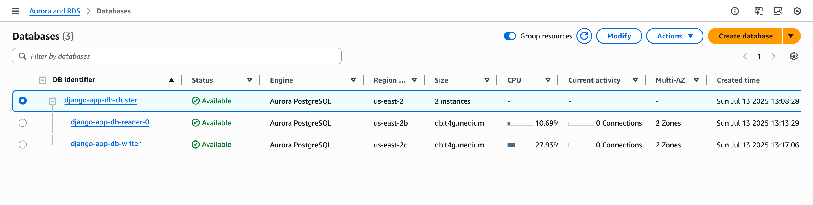
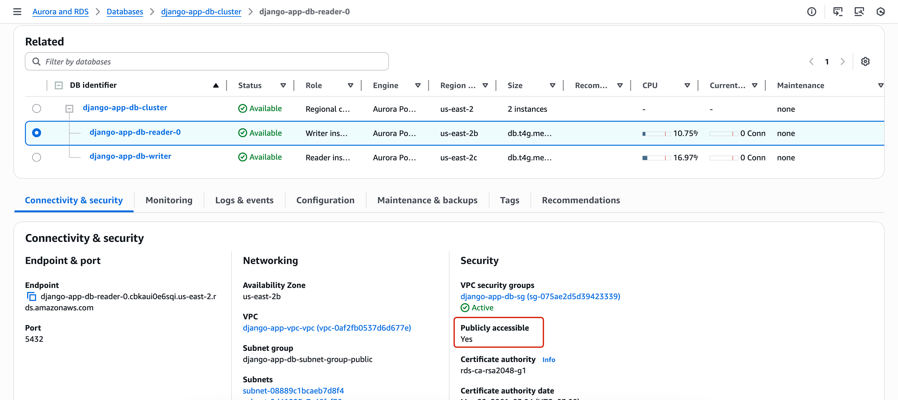
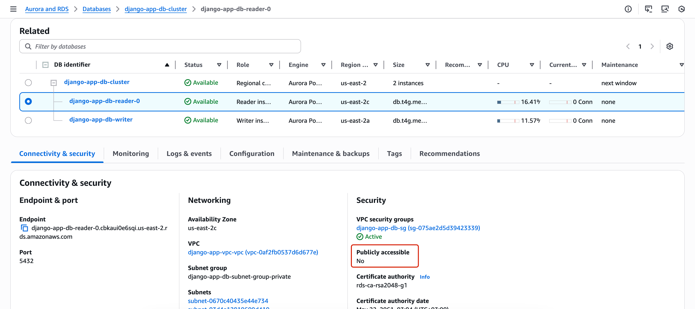
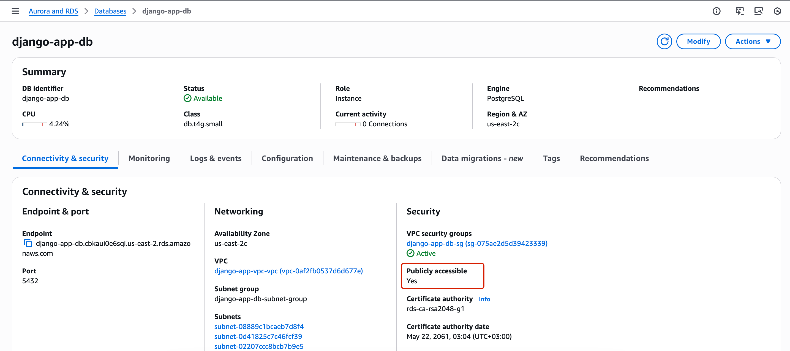
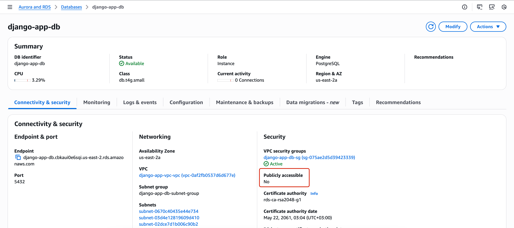
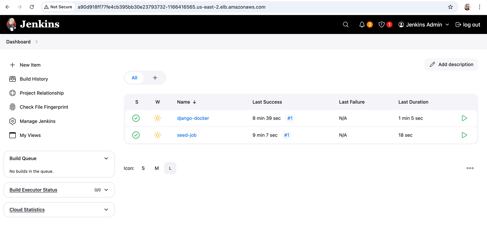
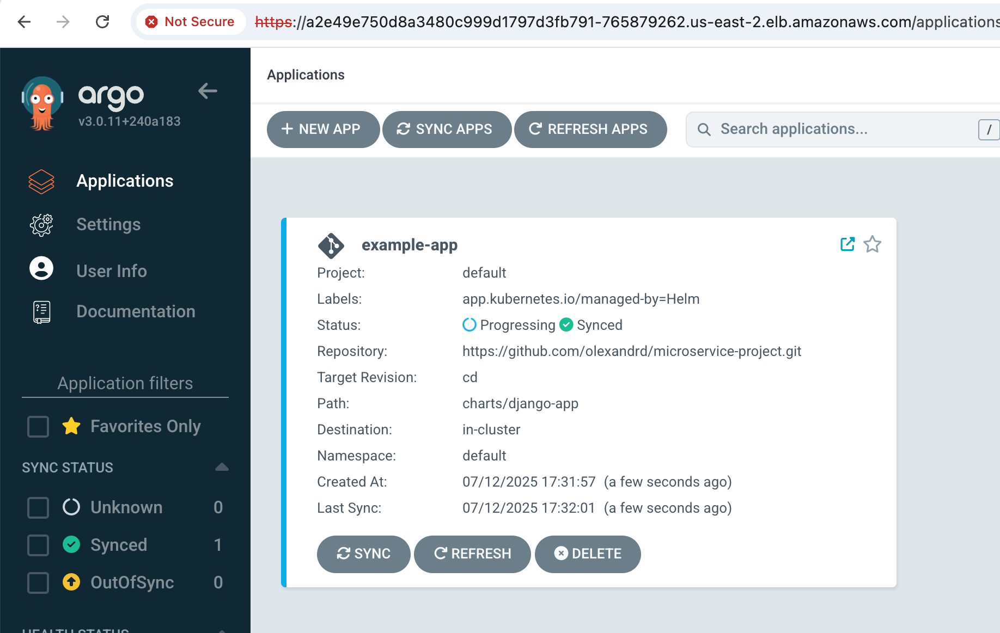
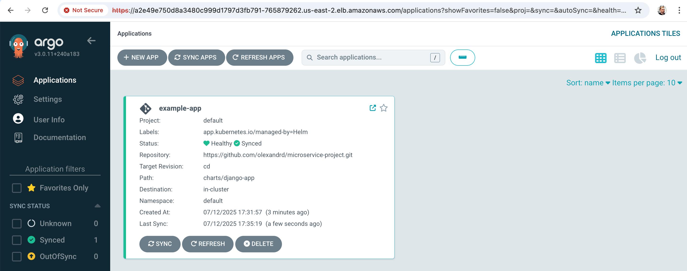
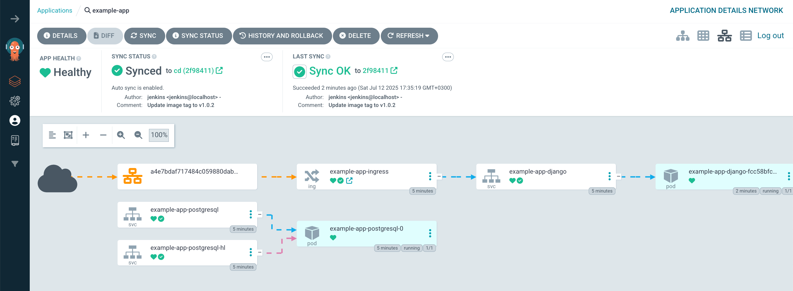

# Application Deployment with CD Pipeline

## Table of Contents

- [Application Deployment with CD Pipeline](#application-deployment-with-cd-pipeline)
  - [Table of Contents](#table-of-contents)
  - [Prerequisites](#prerequisites)
  - [Steps to set up the environment](#steps-to-set-up-the-environment)
  - [RDS Configuration](#rds-configuration)
    - [Basic usage](#basic-usage)
    - [RDS configuration options](#rds-configuration-options)
      - [Configuration file](#configuration-file)
      - [CLI options](#cli-options)
    - [RDS setup examples](#rds-setup-examples)
  - [Access to CD pipeline](#access-to-cd-pipeline)
  - [Build and push Docker image to ECR](#build-and-push-docker-image-to-ecr)
  - [Configure cluster](#configure-cluster)
  - [Argo CD integration](#argo-cd-integration)
  - [Deploy Django application](#deploy-django-application)

This directory contains the source code and resources for deploying demo applications on EKS.

*Disclaimer: NAT instance is used for outbound internet access instead of an AWS NAT Gateway for the
cost savings.
Spot instances on EKS nodes are used for the same reason.*

*Disclaimer: Chart is configured to use `django.stage.fixer.tools` domain for application and ingress.
But setting up domain is out of scope for this task.
`django.stage.fixer.tools` was configured manually to point to created Load Balancer.
You can use your own domain instead of `django.stage.fixer.tools` and point it to the Load Balancer
that is created during your Helm chart deployment
(helm install ... --set ingress.host=your_domain or redefine in ArgoCD).*

## Prerequisites

- AWS CLI installed and configured
- kubectl installed
- Helm installed
- Docker installed
- Terraform installed

Optionally, you can add `terraform.tfvars` file to the root directory of the project.

This file can contain the following variables:

```hcl
github_repo_url = "https://github.com/olexandrd/microservice-project.git"
github_branch = "your_branch_name"
github_username = "your_github_username"
github_token = "pat_token_here"

rds_password = "password_here"
rds_publicly_accessible = true
rds_use_aurora = true
rds_multi_az = false
rds_backup_retention_period = "0"
```

## Steps to set up the environment

For this task, we will use an EKS cluster in the `us-east-2` region.
There is 2 step to initialize the project, first you need to initialize the remote
backend and then the main project.

```sh
cd modules/s3-backend
terraform init
terraform plan
terraform apply

```

After backend is initialized, you can go back to the repo root directory and deploy EKS cluster.

```sh
cd ../../
terraform init
terraform plan
terraform apply

```

## RDS Configuration

Module `modules/rds` can be used to create RDS, including both standard RDS instances and Aurora clusters.

Database password setting `rds_password` can be set in the `terraform.tfvars` file, passed using prompt during the Terraform apply command or passed as an environment variable.

### Basic usage

To create a standard Aurora cluster without public access, you can use the following command:

```sh
terraform apply -target=module.rds
```



### RDS configuration options

You can configure the RDS module using the following variables in `terraform.tfvars` or as command-line options.

#### Configuration file

You can configure the RDS module using the following variables in `terraform.tfvars`:

```hcl
rds_publicly_accessible = true # false for private access
rds_use_aurora = true # false for standard RDS instance
rds_multi_az = false # true for multi-AZ deployment
rds_backup_retention_period = "0" # Set to "0" for no backups, or specify the number of days for backups
```

#### CLI options

You can also configure the RDS module using command-line options when running Terraform:

```sh
terraform apply -target=module.rds \
  -var="rds_publicly_accessible=true" \
  -var="rds_use_aurora=false" \
  -var="rds_multi_az=false" 
```

### RDS setup examples

- Aurora cluster with public access:

```sh
terraform apply -target=module.rds \
  -var="rds_publicly_accessible=true" \
  -var="rds_use_aurora=true" 
```



- Aurora cluster on private subnets:

```sh
terraform apply -target=module.rds \
  -var="rds_publicly_accessible=false" \
  -var="rds_use_aurora=true"
```



- Standard RDS instance with public access:

```sh
terraform apply -target=module.rds \
  -var="rds_publicly_accessible=true" \
  -var="rds_use_aurora=false"
```



- Standard RDS instance on private subnets:

```sh
terraform apply -target=module.rds \
  -var="rds_publicly_accessible=false" \
  -var="rds_use_aurora=false"
```



## Access to CD pipeline

Needed endpoints, Jenkins and ArgoCD, can be found on the AWS console, under EC2 Load Balancers.

## Build and push Docker image to ECR

To build and push the Docker image to ECR, follow these steps:

- Open Jenkins in your browser (the URL can be found in the AWS console under EC2 Load Balancers).
- On Jenkins settings page select Script Approval and approve seed job script.
- Create a new pipeline job using the seed job.
- Run the pipeline job to build the Docker image and push it to ECR.

Example:


## Configure cluster

To configure your local `kubectl` to connect to the EKS cluster, run the following command:

```sh
aws eks --region us-east-2 update-kubeconfig --name eks-cluster-demo
```

## Argo CD integration

Terraform configuration includes Argo CD setup.
ArgoCD applications and repositories are defined in the `modules/argo_cd/charts` directory and
created during the Terraform apply.

For controlling ArgoCD applications, you can use the ArgoCD UI.
ArgoCD URL can be found in the AWS console under EC2 Load Balancers.
To access the ArgoCD UI, you need to get the initial admin password. Run the following command:

```sh
kubectl -n argocd get secret argocd-initial-admin-secret -o jsonpath="{.data.password}" | base64 -d
```

## Deploy Django application

CD pipeline uses Jenkins only.
It can be verified in Argocd UI.

- Before Jenkins job execution, ArgoCD application is in `OutOfSync` state.

- After Jenkins job execution, ArgoCD application is in `Synced` state.

- ArgoCD UI shows the deployed application and its resources.

