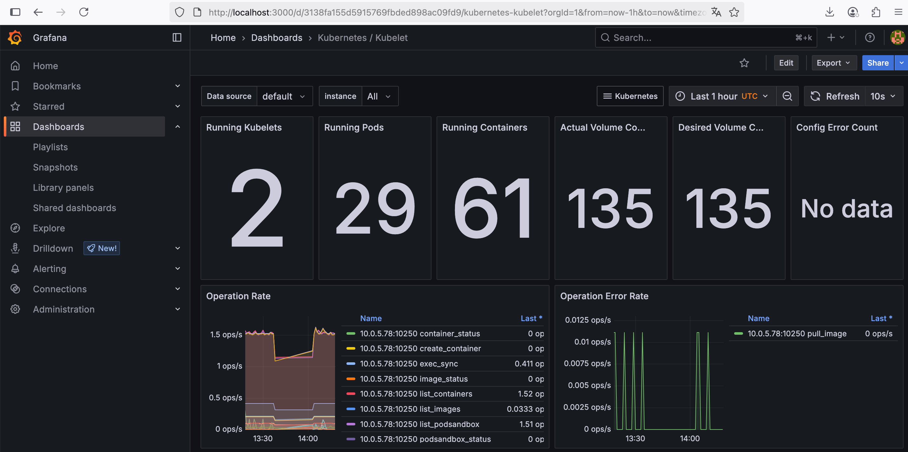

# Application Deployment with CD Pipeline

## Table of Contents

- [Application Deployment with CD Pipeline](#application-deployment-with-cd-pipeline)
  - [Table of Contents](#table-of-contents)
  - [Prerequisites](#prerequisites)
  - [Steps to set up the environment](#steps-to-set-up-the-environment)
  - [RDS Configuration](#rds-configuration)
    - [Basic usage](#basic-usage)
    - [RDS configuration options](#rds-configuration-options)
      - [Configuration file](#configuration-file)
      - [CLI options](#cli-options)
    - [RDS setup examples](#rds-setup-examples)
  - [Configure cluster](#configure-cluster)
  - [Access the deployed stack](#access-the-deployed-stack)
    - [Network access](#network-access)
  - [Build and push Docker image to ECR](#build-and-push-docker-image-to-ecr)
  - [Argo CD integration](#argo-cd-integration)
  - [Deploy Django application](#deploy-django-application)
  - [Monitoring](#monitoring)

This directory contains the source code and resources for deploying demo applications on EKS.

*Disclaimer: NAT instance is used for outbound internet access instead of an AWS NAT Gateway for the
cost savings.
Spot instances on EKS nodes are used for the same reason.*

*Disclaimer: Chart is configured to use `django.stage.fixer.tools` domain for application and ingress.
But setting up domain is out of scope for this task.
`django.stage.fixer.tools` was configured manually to point to created Load Balancer.
You can use your own domain instead of `django.stage.fixer.tools` and point it to the Load Balancer
that is created during your Helm chart deployment
(helm install ... --set ingress.host=your_domain or redefine in ArgoCD).*

## Prerequisites

- AWS CLI installed and configured
- kubectl installed
- Helm installed
- Docker installed
- Terraform installed

Optionally, you can add `terraform.tfvars` file to the root directory of the project.

This file can contain the following variables:

```hcl
github_repo_url = "https://github.com/olexandrd/microservice-project.git"
github_branch = "your_branch_name"
github_username = "your_github_username"
github_token = "pat_token_here"

rds_password = "password_here"
rds_publicly_accessible = true
rds_use_aurora = true
rds_multi_az = false
rds_backup_retention_period = "0"
```

## Steps to set up the environment

For this task, we will use an EKS cluster in the `us-east-2` region.
There is 2 step to initialize the project, first you need to initialize the remote
backend and then the main project.

```sh
cd modules/s3-backend
terraform init
terraform plan
terraform apply

```

After backend is initialized, you can go back to the repo root directory and deploy EKS cluster.

```sh
cd ../../
terraform init
terraform plan
terraform apply

```

## RDS Configuration

Module `modules/rds` can be used to create RDS, including both standard RDS instances and Aurora clusters.

Database password setting `rds_password` can be set in the `terraform.tfvars` file, passed using prompt during the Terraform apply command or passed as an environment variable.

### Basic usage

To create a standard Aurora cluster without public access, you can use the following command:

```sh
terraform apply -target=module.rds
```


### RDS configuration options

You can configure the RDS module using the following variables in `terraform.tfvars` or as command-line options.

#### Configuration file

You can configure the RDS module using the following variables in `terraform.tfvars`:

```hcl
rds_publicly_accessible = true # false for private access
rds_use_aurora = true # false for standard RDS instance
rds_multi_az = false # true for multi-AZ deployment
rds_instance_class = "db.t3.medium" # Instance class for RDS
rds_backup_retention_period = "0" # Set to "0" for no backups, or specify the number of days for backups
```

Database engine and version can be configured using the following variables:

```hcl
rds_aurora_engine = "aurora-postgresql" # Engine for Aurora cluster
rds_aurora_engine_version = "15.3" # Version for Aurora cluster
rds_aurora_parameter_group_family = "aurora-postgresql15" # Parameter group family for Aurora cluster 
rds_instance_engine = "postgres" # Engine for standard RDS instance
rds_instance_engine_version = "17.2" # Version for standard RDS instance
rds_instance_parameter_group_family = "postgres17" # Parameter group family for standard RDS instance
rds_instance_class = "db.t4g.medium" # Instance class for standard RDS instance
```

#### CLI options

You can also configure the RDS module using command-line options when running Terraform:

```sh
terraform apply -target=module.rds \
  -var="rds_publicly_accessible=true" \
  -var="rds_use_aurora=false" \
  -var="rds_multi_az=false" \
  -var="rds_instance_class=db.t4g.medium"
```

### RDS setup examples

- Aurora cluster with public access:

```sh
terraform apply -target=module.rds \
  -var="rds_publicly_accessible=true" \
  -var="rds_use_aurora=true" 
```


- Aurora cluster on private subnets:

```sh
terraform apply -target=module.rds \
  -var="rds_publicly_accessible=false" \
  -var="rds_use_aurora=true"
```


- Standard RDS instance with public access:

```sh
terraform apply -target=module.rds \
  -var="rds_publicly_accessible=true" \
  -var="rds_use_aurora=false"
```


- Standard RDS instance on private subnets:

```sh
terraform apply -target=module.rds \
  -var="rds_publicly_accessible=false" \
  -var="rds_use_aurora=false"
```


## Configure cluster

To configure your local `kubectl` to connect to the EKS cluster, run the following command:

```sh
aws eks --region us-east-2 update-kubeconfig --name eks-cluster-demo
```

## Access the deployed stack

We can ensure that application and supplemental services are running by checking the status of the resources and services in the `jenkins`, `argocd`, and `monitoring` namespaces.

- Jenkins

```log

kubectl get all -n jenkins
NAME            READY   STATUS    RESTARTS       AGE
pod/jenkins-0   2/2     Running   13 (27m ago)   67m

NAME                    TYPE           CLUSTER-IP      EXTERNAL-IP                                                              PORT(S)        AGE
service/jenkins         LoadBalancer   172.20.174.37   a089f204d5c1146a89988c0fbc1c52ab-524666530.us-east-2.elb.amazonaws.com   80:32623/TCP   67m
service/jenkins-agent   ClusterIP      172.20.102.87   <none>                                                                   50000/TCP      67m

NAME                       READY   AGE
statefulset.apps/jenkins   1/1     67m
```

- ArgoCD
  
```log
kubectl get all -n argocd
NAME                                                           READY   STATUS    RESTARTS   AGE
pod/argo-cd-argocd-application-controller-0                    1/1     Running   0          16m
pod/argo-cd-argocd-applicationset-controller-d7994cb-5tvpj     1/1     Running   0          95m
pod/argo-cd-argocd-dex-server-84fd9f7cb9-2752p                 1/1     Running   0          95m
pod/argo-cd-argocd-notifications-controller-75d578bbb9-9gtnq   1/1     Running   0          95m
pod/argo-cd-argocd-redis-98d744b5-phw2p                        1/1     Running   0          17m
pod/argo-cd-argocd-repo-server-84f9686999-kbhhp                1/1     Running   0          95m
pod/argo-cd-argocd-server-67ccfb79fc-mnhzl                     1/1     Running   0          16m

NAME                                               TYPE           CLUSTER-IP       EXTERNAL-IP                                                               PORT(S)                      AGE
service/argo-cd-argocd-applicationset-controller   ClusterIP      172.20.174.235   <none>                                                                    7000/TCP                     95m
service/argo-cd-argocd-dex-server                  ClusterIP      172.20.50.26     <none>                                                                    5556/TCP,5557/TCP            95m
service/argo-cd-argocd-redis                       ClusterIP      172.20.55.206    <none>                                                                    6379/TCP                     95m
service/argo-cd-argocd-repo-server                 ClusterIP      172.20.61.1      <none>                                                                    8081/TCP                     95m
service/argo-cd-argocd-server                      LoadBalancer   172.20.136.15    a94b10328696b488cbda3f340a6cb0f2-1060447777.us-east-2.elb.amazonaws.com   80:31683/TCP,443:30087/TCP   95m

NAME                                                       READY   UP-TO-DATE   AVAILABLE   AGE
deployment.apps/argo-cd-argocd-applicationset-controller   1/1     1            1           95m
deployment.apps/argo-cd-argocd-dex-server                  1/1     1            1           95m
deployment.apps/argo-cd-argocd-notifications-controller    1/1     1            1           95m
deployment.apps/argo-cd-argocd-redis                       1/1     1            1           95m
deployment.apps/argo-cd-argocd-repo-server                 1/1     1            1           95m
deployment.apps/argo-cd-argocd-server                      1/1     1            1           95m

NAME                                                                 DESIRED   CURRENT   READY   AGE
replicaset.apps/argo-cd-argocd-applicationset-controller-d7994cb     1         1         1       95m
replicaset.apps/argo-cd-argocd-dex-server-84fd9f7cb9                 1         1         1       95m
replicaset.apps/argo-cd-argocd-notifications-controller-75d578bbb9   1         1         1       95m
replicaset.apps/argo-cd-argocd-redis-98d744b5                        1         1         1       95m
replicaset.apps/argo-cd-argocd-repo-server-84f9686999                1         1         1       95m
replicaset.apps/argo-cd-argocd-server-67ccfb79fc                     1         1         1       95m

NAME                                                     READY   AGE
statefulset.apps/argo-cd-argocd-application-controller   1/1     95m

```

- Prometheus and Grafana

```log
kubectl get all -n monitoring
NAME                                                            READY   STATUS    RESTARTS   AGE
pod/alertmanager-kube-prometheus-stack-alertmanager-0           2/2     Running   0          20m
pod/kube-prometheus-stack-grafana-748cbc5458-l5scr              3/3     Running   0          20m
pod/kube-prometheus-stack-kube-state-metrics-684f8c7558-69d2q   1/1     Running   0          20m
pod/kube-prometheus-stack-operator-6c64c966fb-cfjv9             1/1     Running   0          20m
pod/kube-prometheus-stack-prometheus-node-exporter-5cn5k        1/1     Running   0          20m
pod/kube-prometheus-stack-prometheus-node-exporter-7hsrv        1/1     Running   0          20m
pod/prometheus-kube-prometheus-stack-prometheus-0               2/2     Running   0          20m

NAME                                                     TYPE        CLUSTER-IP       EXTERNAL-IP   PORT(S)                      AGE
service/alertmanager-operated                            ClusterIP   None             <none>        9093/TCP,9094/TCP,9094/UDP   20m
service/kube-prometheus-stack-alertmanager               ClusterIP   172.20.185.188   <none>        9093/TCP,8080/TCP            20m
service/kube-prometheus-stack-grafana                    ClusterIP   172.20.113.52    <none>        80/TCP                       20m
service/kube-prometheus-stack-kube-state-metrics         ClusterIP   172.20.79.102    <none>        8080/TCP                     20m
service/kube-prometheus-stack-operator                   ClusterIP   172.20.71.11     <none>        443/TCP                      20m
service/kube-prometheus-stack-prometheus                 ClusterIP   172.20.212.4     <none>        9090/TCP,8080/TCP            20m
service/kube-prometheus-stack-prometheus-node-exporter   ClusterIP   172.20.228.109   <none>        9100/TCP                     20m
service/prometheus-operated                              ClusterIP   None             <none>        9090/TCP                     20m

NAME                                                            DESIRED   CURRENT   READY   UP-TO-DATE   AVAILABLE   NODE SELECTOR            AGE
daemonset.apps/kube-prometheus-stack-prometheus-node-exporter   2         2         2       2            2           kubernetes.io/os=linux   20m

NAME                                                       READY   UP-TO-DATE   AVAILABLE   AGE
deployment.apps/kube-prometheus-stack-grafana              1/1     1            1           20m
deployment.apps/kube-prometheus-stack-kube-state-metrics   1/1     1            1           20m
deployment.apps/kube-prometheus-stack-operator             1/1     1            1           20m

NAME                                                                  DESIRED   CURRENT   READY   AGE
replicaset.apps/kube-prometheus-stack-grafana-748cbc5458              1         1         1       20m
replicaset.apps/kube-prometheus-stack-kube-state-metrics-684f8c7558   1         1         1       20m
replicaset.apps/kube-prometheus-stack-operator-6c64c966fb             1         1         1       20m

NAME                                                               READY   AGE
statefulset.apps/alertmanager-kube-prometheus-stack-alertmanager   1/1     20m
statefulset.apps/prometheus-kube-prometheus-stack-prometheus       1/1     20m

```

### Network access

For easy access to the supplemental services, you can use the following commands:

```sh
kubectl port-forward svc/jenkins 8080:80 -n jenkins
kubectl port-forward svc/argo-cd-argocd-server 8081:443 -n argocd
kubectl port-forward svc/kube-prometheus-stack-grafana 3000:80 -n monitoring
```

This will allow you to access Jenkins at `http://localhost:8080`, ArgoCD at `https://localhost:8081`, and Grafana at `http://localhost:3000`.

## Build and push Docker image to ECR

To build and push the Docker image to ECR, follow these steps:

- Open Jenkins in your browser.
- On Jenkins settings page select Script Approval and approve seed job script.
- Create a new pipeline job using the seed job.
- Run the pipeline job to build the Docker image and push it to ECR.

Example:


## Argo CD integration

Terraform configuration includes Argo CD setup.
ArgoCD applications and repositories are defined in the `modules/argo_cd/charts` directory and
created during the Terraform apply.

For controlling ArgoCD applications, you can use the ArgoCD UI.
ArgoCD URL can be found in the AWS console under EC2 Load Balancers.
To access the ArgoCD UI, you need to get the initial admin password. Run the following command:

```sh
kubectl -n argocd get secret argocd-initial-admin-secret -o jsonpath="{.data.password}" | base64 -d
```

## Deploy Django application

CD pipeline uses Jenkins to build and push Docker image to ECR, and ArgoCD to deploy the application on EKS.
Application uses database created by RDS module, database connection parameters are passed to the ArgoCD application.
It can be verified in Argocd UI.

- Before Jenkins job execution, ArgoCD application is in `OutOfSync` state.

- After Jenkins job execution, ArgoCD application is in `Synced` state.

- ArgoCD UI shows the deployed application and its resources.

- Application uses database created by RDS module.


## Monitoring

Monitoring is set up using *kube-prometheus-stack* helm chart.
It includes Prometheus, Grafana with common dashboards, Alertmanager and node exporters.

For verifying monitoring setup, we can open Grafana in the browser.


