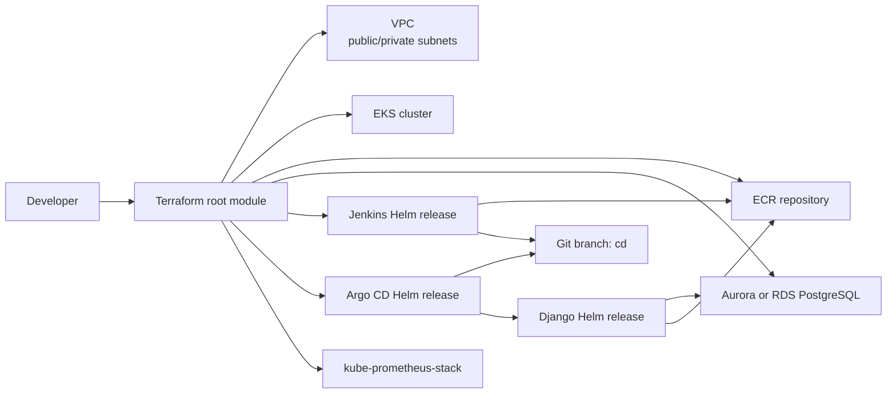

# Architecture

## Overview

This repository builds an AWS-hosted demo platform for a Django application. Terraform creates the AWS infrastructure and installs the Kubernetes platform services. Jenkins builds the application image, pushes it to ECR, and updates the Helm chart image tag on a Git branch. Argo CD watches that branch and deploys the Django chart into EKS.



## Network

The VPC module creates:

- One VPC with DNS support and DNS hostnames enabled.
- Three public subnets tagged for Kubernetes external load balancers.
- Three private subnets for worker nodes and private workloads.
- An internet gateway for public subnet egress.
- A private route table that sends outbound traffic through a NAT EC2 instance.

The project intentionally uses a NAT instance instead of an AWS NAT Gateway for cost savings. The NAT instance runs in the first public subnet, disables source/destination checks, enables IP forwarding, and applies iptables masquerading for the VPC CIDR.

## Compute

The EKS module creates:

- An EKS control plane with public and private API endpoint access.
- IAM access entries for the AWS account root principal.
- A managed node group named `general`.
- SPOT worker nodes in the private subnets.
- Worker-node IAM policies for EKS, VPC CNI, and ECR read access.
- An OIDC provider used by Kubernetes service accounts such as Jenkins.

Root Terraform currently passes:

- Cluster name: `eks-cluster-demo`
- Node instance type: `t3.medium`
- Desired nodes: `3`
- Min nodes: `2`
- Max nodes: `4`

## Container Registry

The ECR module creates a single repository named `app` from the root module. Image scanning on push is enabled by default.

Jenkins publishes images to:

```text
<aws_account_id>.dkr.ecr.us-east-2.amazonaws.com/app:<tag>
```

The current Jenkinsfile uses tags shaped like `v1.0.<BUILD_NUMBER>`.

## Database

The RDS module can create either:

- Aurora PostgreSQL cluster, selected when `rds_use_aurora = true`.
- Standard PostgreSQL RDS instance, selected when `rds_use_aurora = false`.

The database is placed in a DB subnet group built from either public or private subnets, depending on `rds_publicly_accessible`. In private mode, the database security group allows PostgreSQL traffic from the VPC CIDR. In public mode, it allows PostgreSQL from `0.0.0.0/0`, so use public mode only for temporary testing.

Root Terraform passes the database endpoint to the Argo CD apps chart. The apps chart injects database values into the Django Helm chart.

## Kubernetes Add-ons

The `k8s_bootstrap` module installs:

- `ingress-nginx` in `kube-system`
- `metrics-server`

The monitoring module installs `kube-prometheus-stack` in the `monitoring` namespace.

The Jenkins module installs Jenkins in the `jenkins` namespace and creates a `jenkins-sa` service account annotated with an IAM role that can push to ECR through IRSA.

The Argo CD module installs Argo CD in the `argocd` namespace and then installs an apps chart that defines the Django application.

## CI/CD Flow

1. Jenkins runs the pipeline from `django/Jenkinsfile`.
2. Kaniko builds `django/Dockerfile`.
3. Jenkins pushes the image to ECR.
4. Jenkins clones the Git repository, creates or resets the `cd` branch, updates `charts/django-app/values.yaml`, commits the image tag, and force-pushes the branch.
5. Argo CD watches `charts/django-app` at target revision `cd`.
6. Argo CD syncs the Django Helm release into the `default` namespace.

## Runtime Traffic

Ingress is enabled in the Django chart by default. The chart expects an ingress controller and a DNS name that points to the created load balancer. The current default host is:

```text
django.stage.fixer.tools
```

Use `--set ingress.host=<your-domain>` or change the Argo CD Helm values when deploying to another domain.

## Security Notes

- `rds_password` and `github_token` are sensitive Terraform variables. Keep them in local `terraform.tfvars`, environment variables, or a secret manager. Do not commit real values.
- The Django chart currently stores application configuration, including the database password, in a ConfigMap. For production, move secrets into Kubernetes Secrets or an external secret provider.
- `DEBUG = True` and the Django `SECRET_KEY` are hardcoded in `django/olexandr_hw/settings.py`. Replace these with environment-driven production settings before using this outside a demo environment.
- The Jenkins pipeline force-pushes the `cd` branch. Protect important branches and keep the deployment branch separate from regular development.
